# Racing clusters with `cluv submit first`

[`cluv submit`](../../commands.md#cluv-submit) normally takes a single cluster name. Pass `first`
instead, and cluv submits the job to **every cluster you're connected to**, waits until one
of them actually starts running, and cancels the rest:

```console
cluv submit first scripts/job.sh -- python main.py --lr 0.01
```


Queue times vary a lot between clusters (and between allocations on the same cluster) depending on
who else is using them right now. If you don't especially care *where* a job runs, `cluv submit
first` lets cluv figure out which cluster happens to be least busy at that moment.

## Which clusters are raced

`first` submits to every cluster you currently have an active SSH connection to (see [`cluv
login`](../../commands.md#cluv-login)), plus the cluster you're running from if you're already on
one. It does **not** connect to clusters you haven't logged into, and it skips [disabled
clusters](../../commands.md#cluv-disable).

```console
cluv login mila narval      # connect to the clusters you want considered
cluv submit first job.sh    # races mila and narval
```

A cluster with more than one job configuration (a list of `sbatch_args`, see ["Multiple job
configurations on the same cluster"](config.md#multiple-job-configurations-on-the-same-cluster))
contributes one submission per configuration to the race. `cluv submit first` and a per-cluster
`sbatch_args` list compose, so a `cluv submit first` with two clusters that each have two
configurations races four jobs at once.

## How the race works

The race between clusters is implemented in three steps:

1. cluv builds a submission for every connected cluster (and every job configuration on each), and
syncs the project to all of them.
2. Every submission is sent to `sbatch`, and cluv polls the status of every job until one leaves the
`PENDING` state.
3. As soon as one job starts running, cluv cancels every other submission.


A live table tracks every submission while this happens:

```console
$ cluv submit first scripts/job.sh -- python main.py --lr 0.01
                                    Submitting jobs...
┏━━━━━━━━━┳━━━━━━━━┳━━━━━━━━━━━┳━━━━━━━━━━━━━━━━━━━━━━━━━━━━━━━━━━━━━━━━━━━━━━━━━━━━┓
┃ Cluster ┃ Job ID ┃ Status    ┃ Command                                            ┃
┡━━━━━━━━━╇━━━━━━━━╇━━━━━━━━━━━╇━━━━━━━━━━━━━━━━━━━━━━━━━━━━━━━━━━━━━━━━━━━━━━━━━━━━┩
│ mila    │ 9001   │ PENDING   │ bash --login -c '(...) --gpus=1 -- python main.py' │
│ narval  │ 4522   │ RUNNING   │ bash --login -c '(...) --gpus=1 -- python main.py' │
└─────────┴────────┴───────────┴────────────────────────────────────────────────────┘
Successfully submitted job 4522 on cluster narval.
```

Once a job is running, cluv reports which cluster it landed on (`narval` here) exactly as it would
for a normal single-cluster submission. You can then use `cluv sync` to fetch results from that
cluster, once the job is done.

!!! note
      Cancelling the `cluv submit first` command (e.g. with Ctrl-C in your terminal) during the wait
      for a running job will cancel all submissions.

!!! note
      The sync step is asynchronous for all clusters, so you don't have to wait for the slowest
      cluster to finish syncing before being able to submit jobs.

## Scripting against the result

With `--parsable`, cluv prints only `<cluster>:<job_id>` for the job that won the race (instead of
just `<job_id>` for a single-cluster submission), and suppresses everything else:

```console
$ cluv submit first scripts/job.sh --parsable -- python main.py
narval:1234
```
